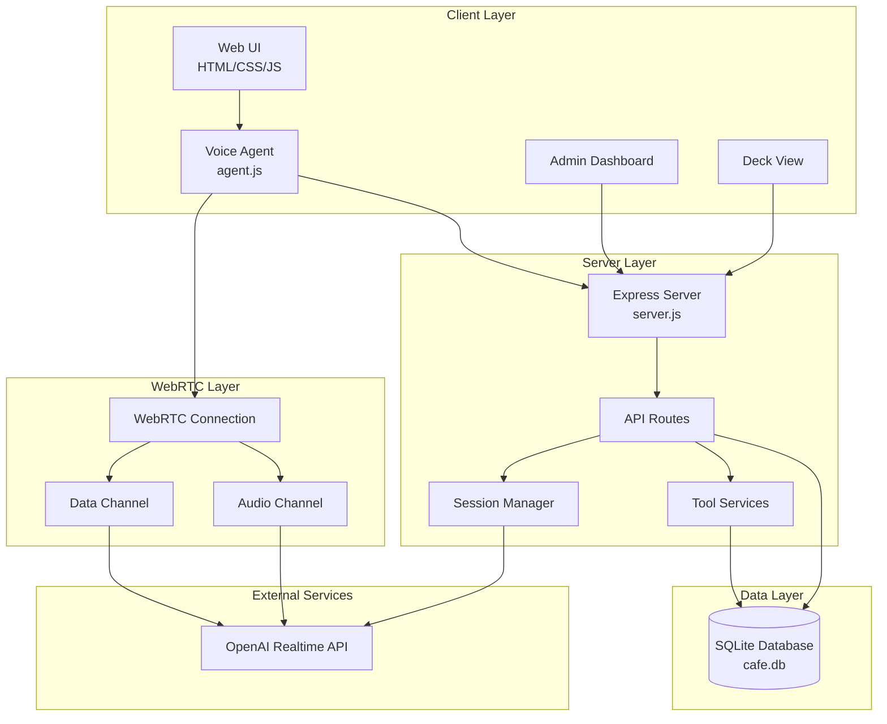
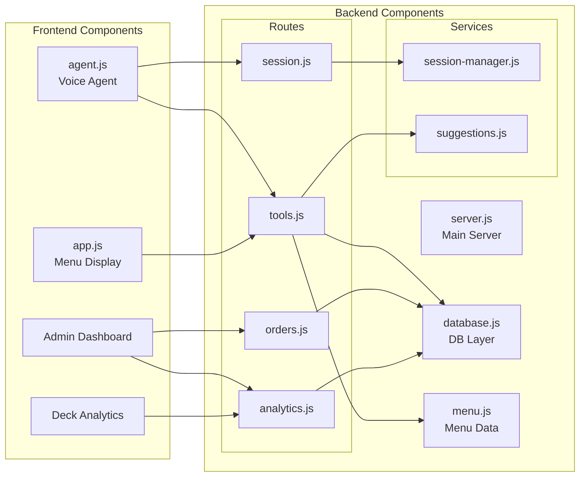
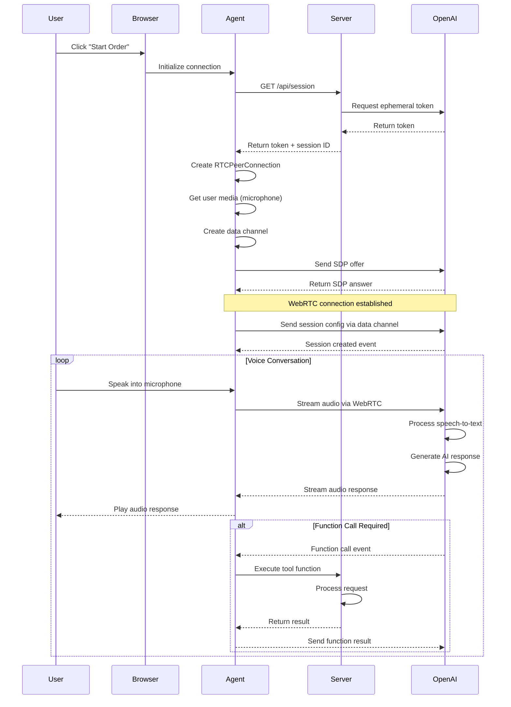
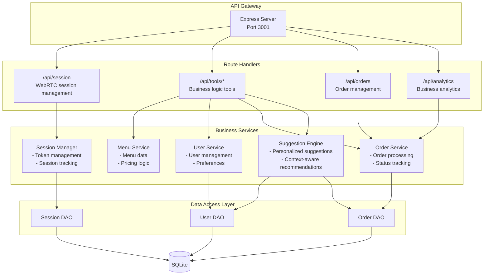
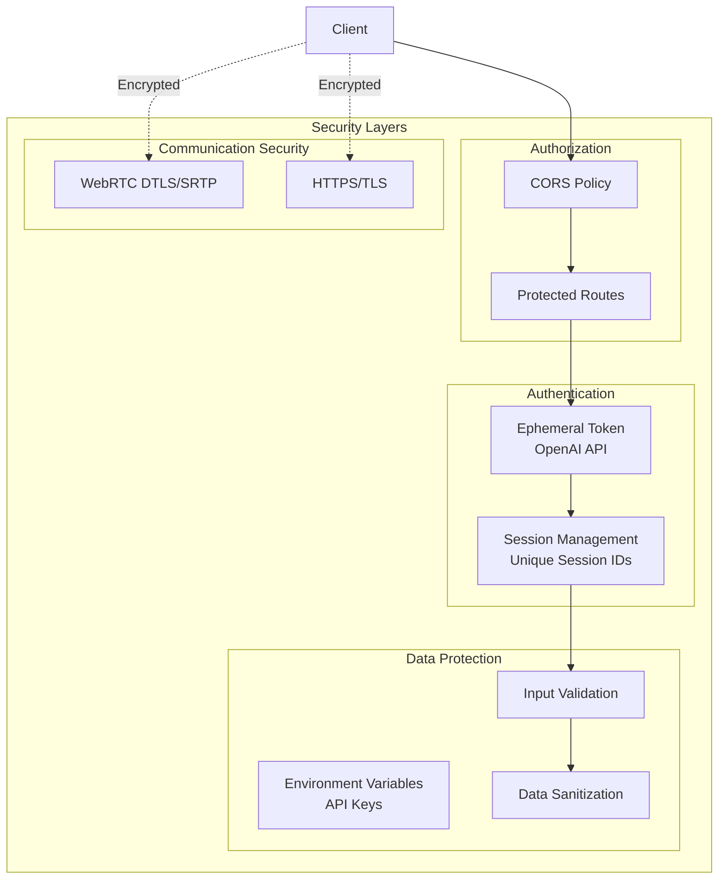
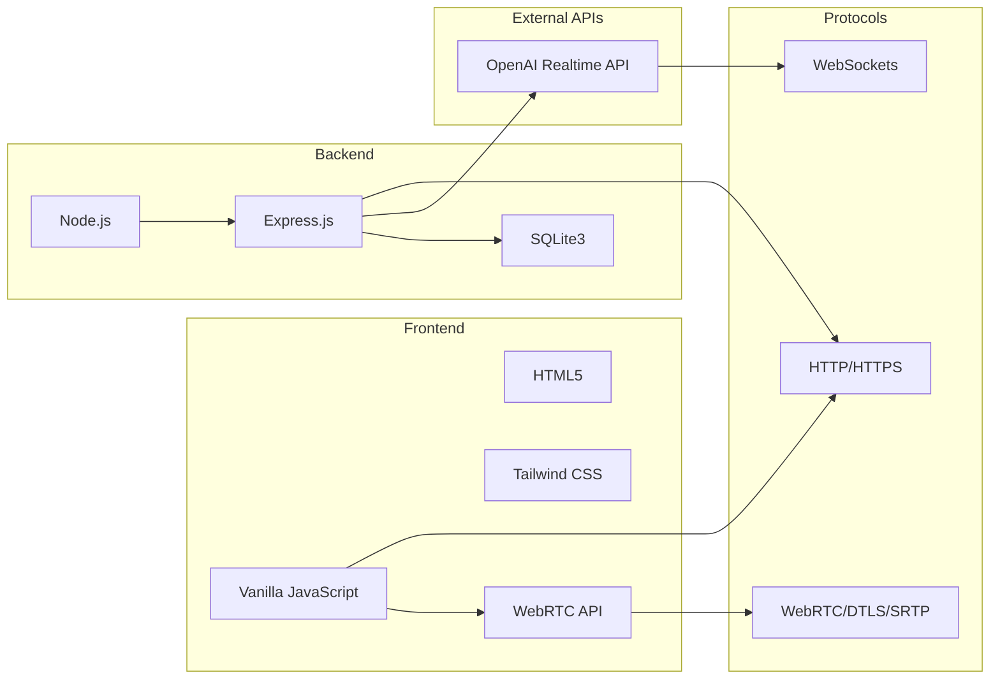
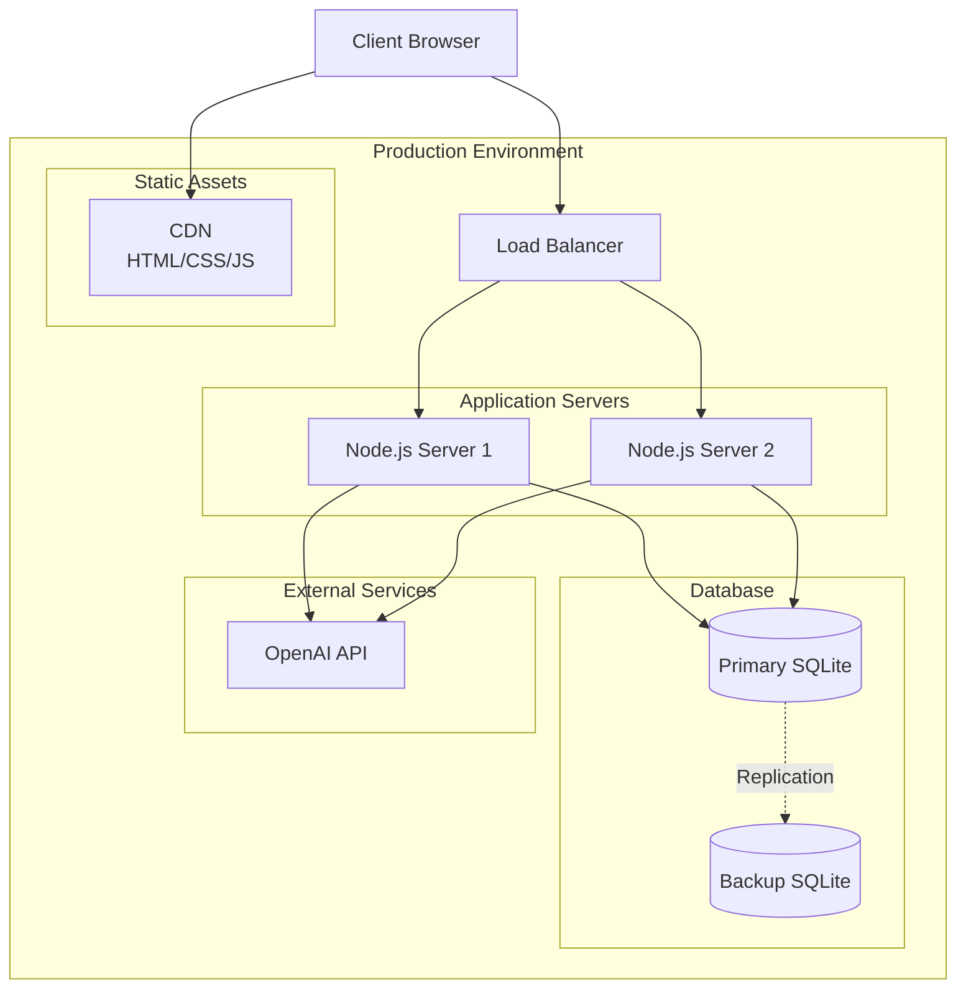

# Brew & Byte Café - System Architecture

## Overview
The Brew & Byte Café is an AI-powered coffee ordering system that uses OpenAI's Realtime API with WebRTC for voice interactions. The system provides a conversational interface for customers to place coffee orders through natural speech.

## High-Level Architecture

## Component Architecture

## WebRTC Communication Flow

## Service Layer Architecture

## Security Architecture

## Technology Stack

## Deployment Architecture

## Key Architectural Decisions

1. **WebRTC for Real-time Voice**: Direct peer-to-peer connection for low-latency audio streaming
2. **SQLite Database**: Lightweight, file-based database suitable for moderate traffic
3. **Stateless Server Design**: Sessions managed via unique IDs, allowing horizontal scaling
4. **Ephemeral Token Pattern**: Secure, time-limited tokens for OpenAI API access
5. **Tool-based Architecture**: Modular function calling system for extensibility
6. **Event-driven Communication**: WebRTC data channel for real-time bidirectional events