# Brew & Byte Café - Data Model

## Overview
This document describes the data model and database schema for the Brew & Byte Café system, including entity relationships, data structures, and storage patterns.

## Entity Relationship Diagram

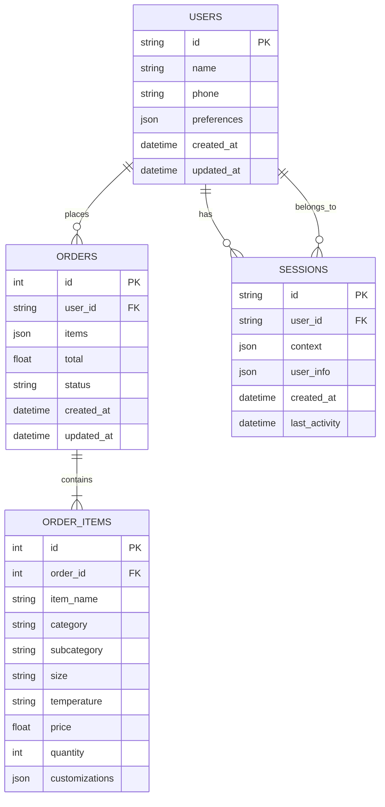

## Database Schema Details

### Users Table

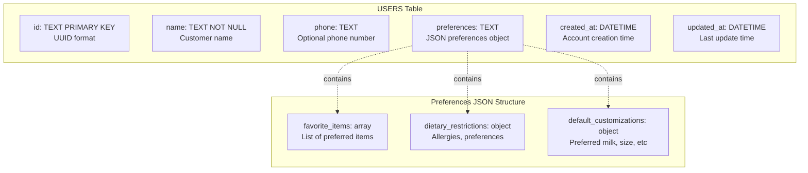

### Orders Table

```mermaid
graph TB
    subgraph "ORDERS Table"
        order_id[id: INTEGER PRIMARY KEY<br/>Auto-increment]
        user_id[user_id: TEXT NOT NULL<br/>Foreign key to USERS]
        items[items: TEXT NOT NULL<br/>JSON array of items]
        total[total: REAL NOT NULL<br/>Order total amount]
        status[status: TEXT<br/>pending|preparing|ready|completed]
        order_created[created_at: DATETIME<br/>Order placement time]
        order_updated[updated_at: DATETIME<br/>Last status update]
    end
    
    subgraph "Status Transitions"
        pending[pending<br/>Initial state]
        preparing[preparing<br/>Being made]
        ready[ready<br/>Ready for pickup]
        completed[completed<br/>Order fulfilled]
        cancelled[cancelled<br/>Order cancelled]
    end
    
    pending --> preparing
    preparing --> ready
    ready --> completed
    pending --> cancelled
    preparing --> cancelled
```

### Order Items Table

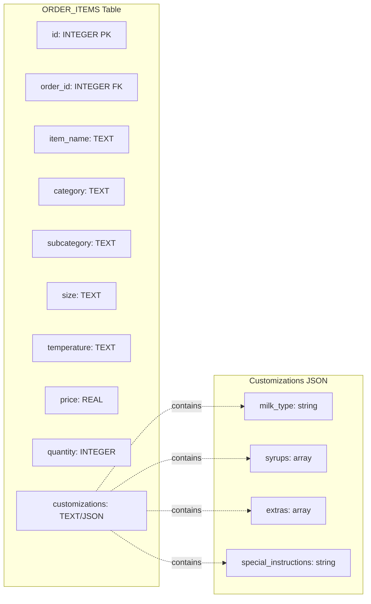

### Sessions Table

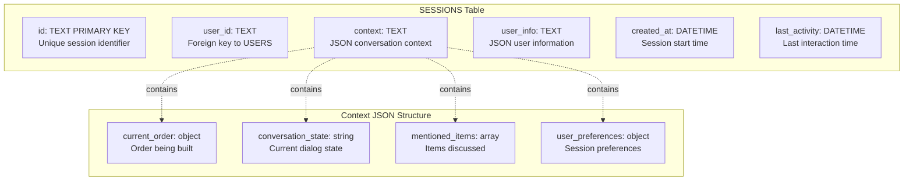

## Menu Data Structure

```mermaid
graph TD
    subgraph "Menu Structure (menu.js)"
        Menu[Menu Object]
        Categories[Categories Array]
        Items[Items Array]
        Customizations[Customizations Object]
    end
    
    subgraph "Category Structure"
        cat_id[id: string]
        cat_name[name: string]
        cat_desc[description: string]
        subcategories[subcategories: array]
    end
    
    subgraph "Item Structure"
        item_id[id: string]
        item_name[name: string]
        item_cat[category: string]
        item_subcat[subcategory: string]
        item_desc[description: string]
        base_price[base_price: number]
        sizes[sizes: object]
        available[available: boolean]
        popular[popular: boolean]
        seasonal[seasonal: boolean]
    end
    
    subgraph "Customization Structure"
        milk_options[milk_options: array]
        syrup_options[syrup_options: array]
        temperature_options[temperature_options: array]
        size_options[size_options: array]
        extras[extras: array]
    end
    
    Menu --> Categories
    Menu --> Items
    Menu --> Customizations
    
    Categories --> cat_id
    Categories --> cat_name
    Categories --> cat_desc
    Categories --> subcategories
    
    Items --> item_id
    Items --> item_name
    Items --> item_cat
    Items --> item_subcat
    Items --> item_desc
    Items --> base_price
    Items --> sizes
    Items --> available
    Items --> popular
    Items --> seasonal
    
    Customizations --> milk_options
    Customizations --> syrup_options
    Customizations --> temperature_options
    Customizations --> size_options
    Customizations --> extras
```

## Data Access Patterns

### User Management

```mermaid
flowchart LR
    subgraph "User Operations"
        FindUser[Find User by Name]
        CreateUser[Create New User]
        UpdateUser[Update User Info]
        GetHistory[Get Order History]
    end
    
    subgraph "Query Patterns"
        ExactMatch[SELECT * FROM users<br/>WHERE LOWER(name) = ?]
        PartialMatch[SELECT * FROM users<br/>WHERE name LIKE ?]
        InsertUser[INSERT INTO users<br/>(id, name, ...)]
        UpdatePref[UPDATE users<br/>SET preferences = ?]
        JoinOrders[SELECT * FROM orders<br/>WHERE user_id = ?]
    end
    
    FindUser --> ExactMatch
    FindUser --> PartialMatch
    CreateUser --> InsertUser
    UpdateUser --> UpdatePref
    GetHistory --> JoinOrders
```

### Order Processing

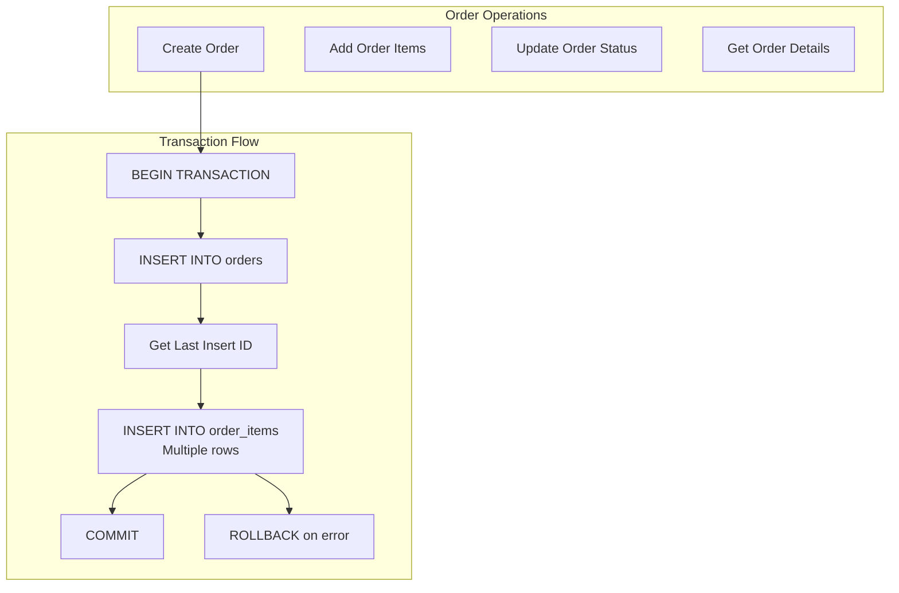

## Indexing Strategy

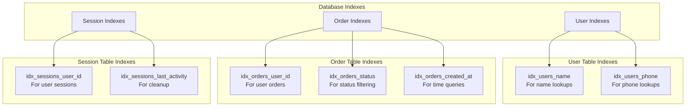

## Data Lifecycle

### Session Data Lifecycle

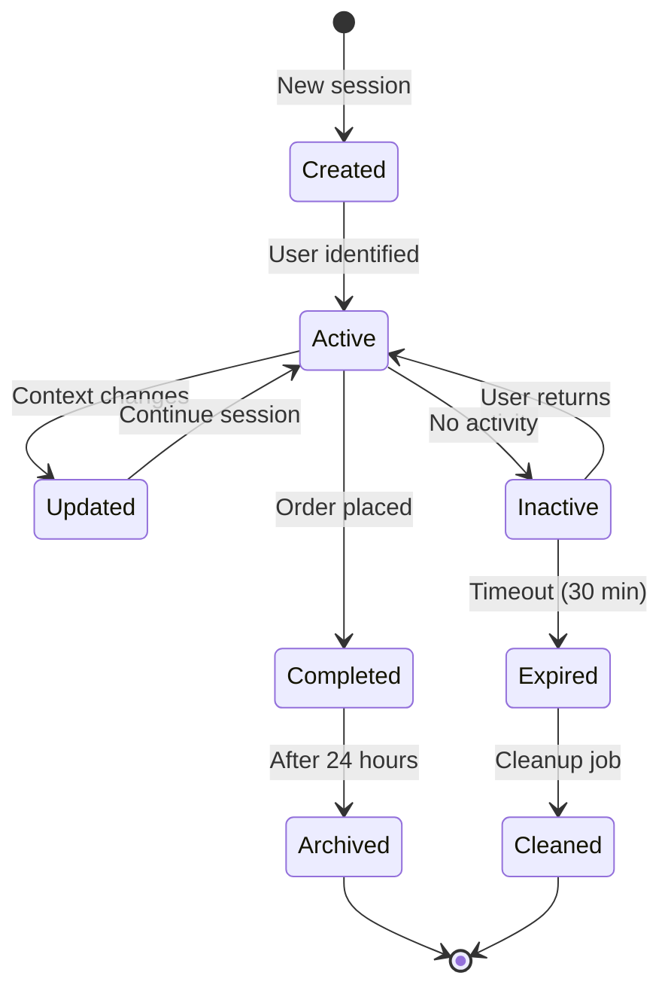

### Order Data Lifecycle

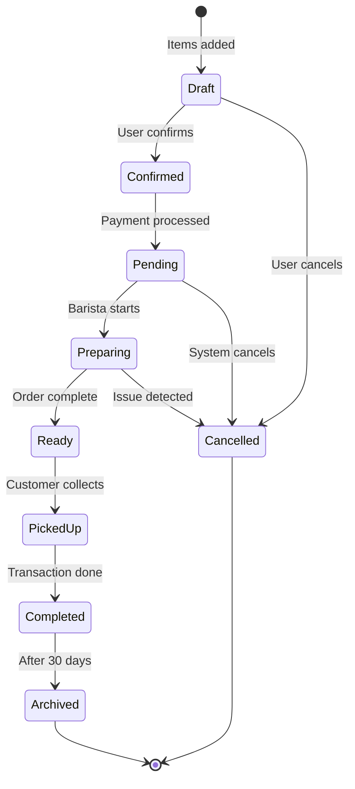

## Analytics Data Model

```mermaid
graph TB
    subgraph "Aggregated Metrics"
        DailySales[Daily Sales]
        ProductMetrics[Product Metrics]
        CustomerMetrics[Customer Metrics]
        PeakHours[Peak Hours]
    end
    
    subgraph "Daily Sales Structure"
        date[date: DATE]
        total_orders[total_orders: INTEGER]
        total_revenue[total_revenue: REAL]
        avg_order_value[avg_order_value: REAL]
        unique_customers[unique_customers: INTEGER]
    end
    
    subgraph "Product Metrics Structure"
        product_id[product_id: STRING]
        product_name[product_name: STRING]
        units_sold[units_sold: INTEGER]
        revenue[revenue: REAL]
        popularity_rank[popularity_rank: INTEGER]
    end
    
    subgraph "Customer Metrics Structure"
        customer_id[customer_id: STRING]
        order_count[order_count: INTEGER]
        total_spent[total_spent: REAL]
        avg_order[avg_order_value: REAL]
        favorite_item[favorite_item: STRING]
        last_order[last_order_date: DATE]
    end
    
    DailySales --> date
    DailySales --> total_orders
    DailySales --> total_revenue
    DailySales --> avg_order_value
    DailySales --> unique_customers
    
    ProductMetrics --> product_id
    ProductMetrics --> product_name
    ProductMetrics --> units_sold
    ProductMetrics --> revenue
    ProductMetrics --> popularity_rank
    
    CustomerMetrics --> customer_id
    CustomerMetrics --> order_count
    CustomerMetrics --> total_spent
    CustomerMetrics --> avg_order
    CustomerMetrics --> favorite_item
    CustomerMetrics --> last_order
```

## Caching Strategy

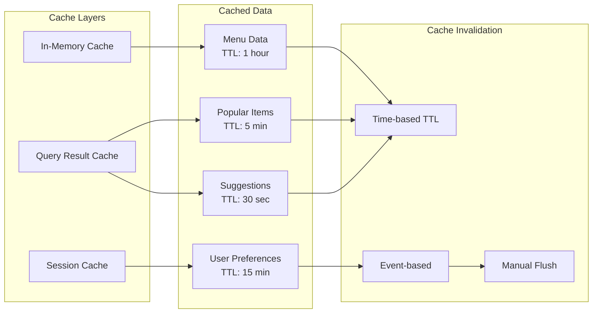

## Data Validation Rules

```mermaid
graph TD
    subgraph "Input Validation"
        UserInput[User Input]
        OrderInput[Order Input]
        SessionInput[Session Input]
    end
    
    subgraph "User Validation Rules"
        NameLength[Name: 2-50 characters]
        NameFormat[Name: Letters and spaces only]
        PhoneFormat[Phone: Valid format]
        PrefsJSON[Preferences: Valid JSON]
    end
    
    subgraph "Order Validation Rules"
        ItemsArray[Items: Non-empty array]
        ItemIds[Item IDs: Valid menu items]
        Quantities[Quantities: Positive integers]
        TotalCalc[Total: Matches calculation]
    end
    
    subgraph "Session Validation Rules"
        SessionID[Session ID: UUID format]
        UserRef[User ID: Exists in database]
        ContextJSON[Context: Valid JSON]
        ActivityTime[Activity: Recent timestamp]
    end
    
    UserInput --> NameLength
    UserInput --> NameFormat
    UserInput --> PhoneFormat
    UserInput --> PrefsJSON
    
    OrderInput --> ItemsArray
    OrderInput --> ItemIds
    OrderInput --> Quantities
    OrderInput --> TotalCalc
    
    SessionInput --> SessionID
    SessionInput --> UserRef
    SessionInput --> ContextJSON
    SessionInput --> ActivityTime
```

## Data Migration Strategy

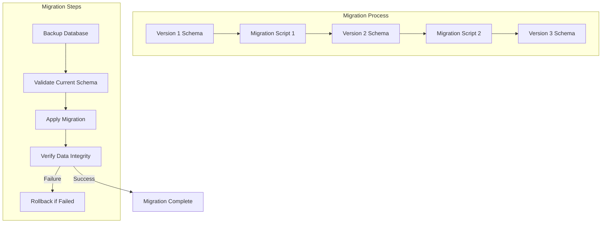