# Brew & Byte Café - Deployment Guide

## Overview
This document provides comprehensive deployment diagrams and strategies for the Brew & Byte Café application across different environments.

## Development Environment

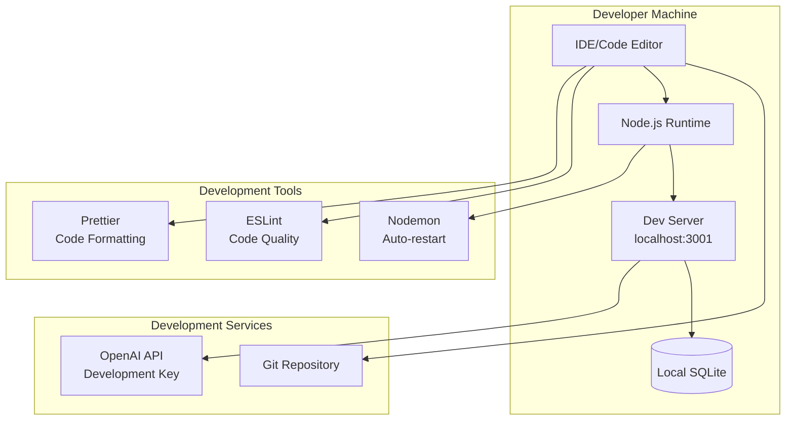

## Staging Environment

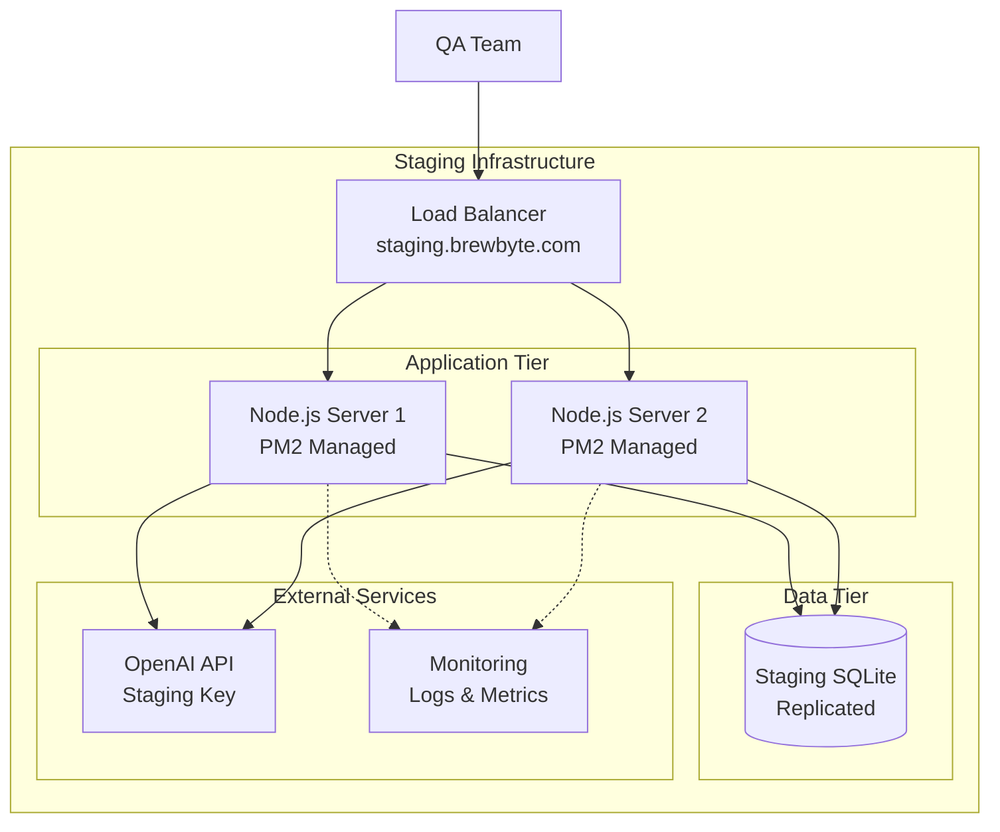

## Production Environment

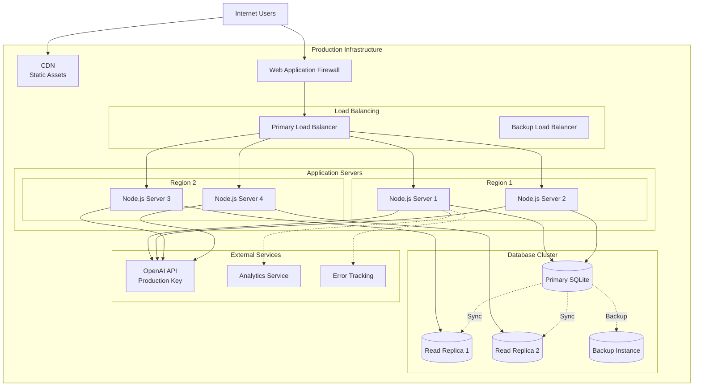

## Container Deployment

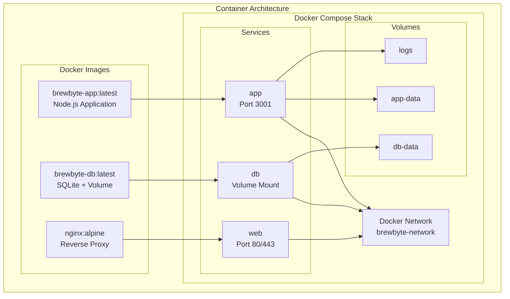

## Kubernetes Deployment

```mermaid
graph TB
    subgraph "Kubernetes Cluster"
        subgraph "Ingress"
            Ingress[Ingress Controller<br/>nginx-ingress]
        end
        
        subgraph "Deployments"
            AppDeploy[App Deployment<br/>Replicas: 3]
            DBDeploy[Database StatefulSet<br/>Replicas: 1]
        end
        
        subgraph "Services"
            AppSvc[App Service<br/>ClusterIP]
            DBSvc[DB Service<br/>ClusterIP]
        end
        
        subgraph "ConfigMaps & Secrets"
            Config[ConfigMap<br/>App Config]
            Secrets[Secrets<br/>API Keys]
        end
        
        subgraph "Persistent Storage"
            PVC[PersistentVolumeClaim<br/>Database Storage]
        end
        
        subgraph "Monitoring"
            Prometheus[Prometheus<br/>Metrics]
            Grafana[Grafana<br/>Dashboards]
        end
    end
    
    Internet[Users] --> Ingress
    Ingress --> AppSvc
    AppSvc --> AppDeploy
    AppDeploy --> DBSvc
    DBSvc --> DBDeploy
    
    AppDeploy --> Config
    AppDeploy --> Secrets
    DBDeploy --> PVC
    
    AppDeploy -.-> Prometheus
    Prometheus -.-> Grafana
```

## CI/CD Pipeline

```mermaid
flowchart LR
    subgraph "Development"
        Dev[Developer]
        LocalTest[Local Tests]
    end
    
    subgraph "Version Control"
        GitHub[GitHub Repository]
        PR[Pull Request]
    end
    
    subgraph "CI Pipeline"
        GHActions[GitHub Actions]
        Build[Build Application]
        Test[Run Tests]
        Lint[Code Quality]
        Security[Security Scan]
    end
    
    subgraph "CD Pipeline"
        BuildImage[Build Docker Image]
        PushRegistry[Push to Registry]
        DeployStaging[Deploy to Staging]
        StagingTests[Staging Tests]
        Approval[Manual Approval]
        DeployProd[Deploy to Production]
    end
    
    Dev --> LocalTest
    LocalTest --> GitHub
    GitHub --> PR
    PR --> GHActions
    
    GHActions --> Build
    Build --> Test
    Test --> Lint
    Lint --> Security
    
    Security --> BuildImage
    BuildImage --> PushRegistry
    PushRegistry --> DeployStaging
    DeployStaging --> StagingTests
    StagingTests --> Approval
    Approval --> DeployProd
```

## Infrastructure as Code

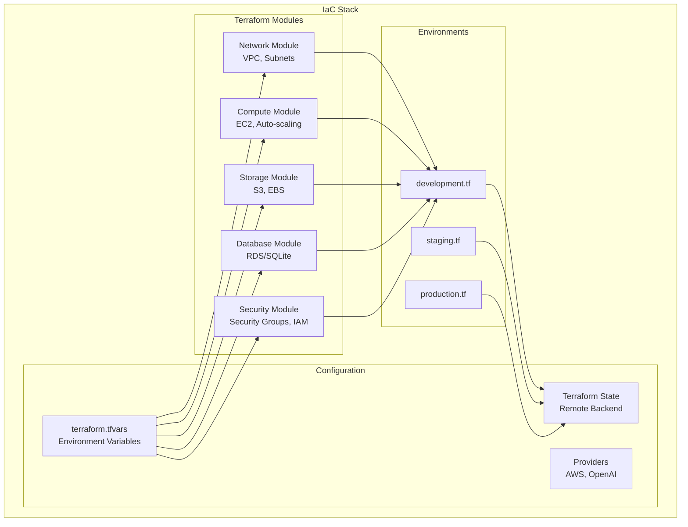

## Monitoring Architecture

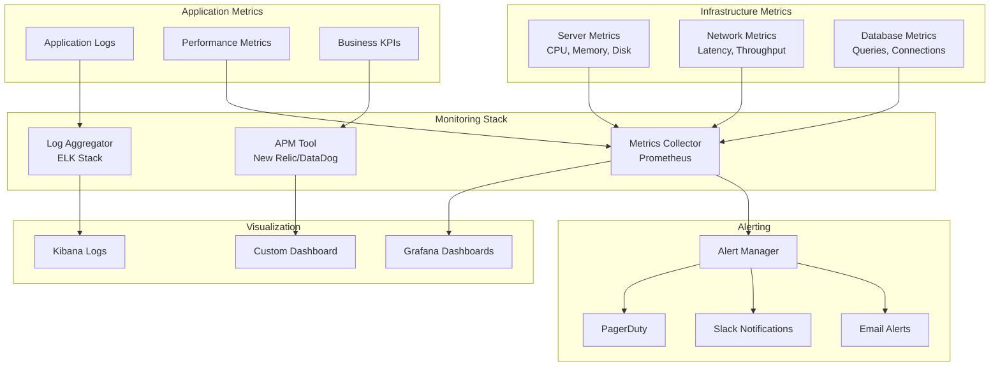

## Disaster Recovery

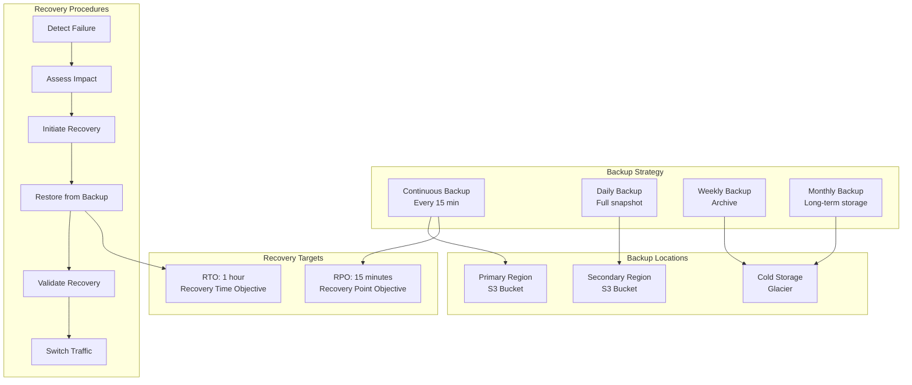

## Security Deployment

```mermaid
graph TB
    subgraph "Security Layers"
        subgraph "Network Security"
            Firewall[Firewall Rules]
            DDoS[DDoS Protection]
            VPN[VPN Access]
        end
        
        subgraph "Application Security"
            WAF2[Web Application Firewall]
            RateLimiting[Rate Limiting]
            CORS[CORS Policy]
        end
        
        subgraph "Data Security"
            Encryption[Encryption at Rest]
            TLS[TLS in Transit]
            Secrets2[Secrets Management]
        end
        
        subgraph "Access Control"
            IAM[IAM Policies]
            MFA[Multi-Factor Auth]
            RBAC[Role-Based Access]
        end
        
        subgraph "Compliance"
            Audit[Audit Logging]
            Compliance[Compliance Checks]
            Scanning[Vulnerability Scanning]
        end
    end
    
    Internet2[External Traffic] --> Firewall
    Firewall --> DDoS
    DDoS --> WAF2
    WAF2 --> RateLimiting
    RateLimiting --> CORS
    
    CORS --> Encryption
    Encryption --> TLS
    TLS --> Secrets2
    
    Secrets2 --> IAM
    IAM --> MFA
    MFA --> RBAC
    
    RBAC --> Audit
    Audit --> Compliance
    Compliance --> Scanning
```

## Scaling Strategy

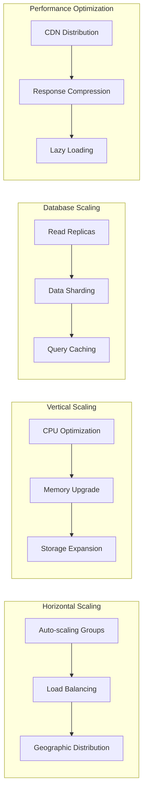

## Deployment Checklist

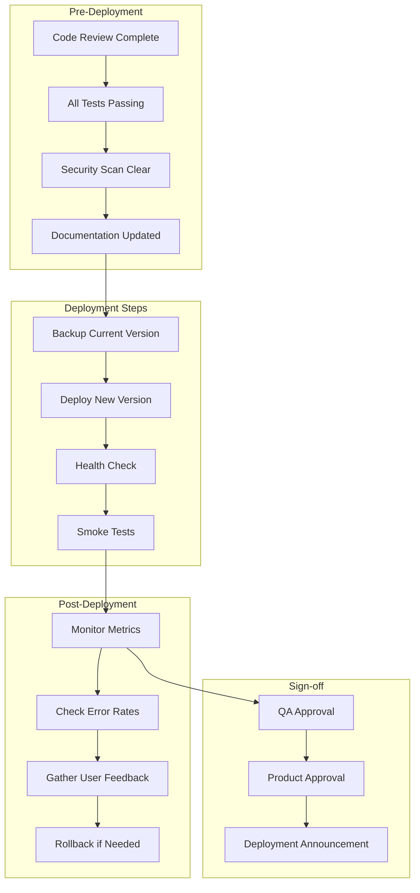

## Environment Configuration

```mermaid
graph TB
    subgraph "Environment Variables"
        subgraph "Development"
            DevPort[PORT=3001]
            DevDB[DATABASE_URL=./cafe.db]
            DevAPI[OPENAI_API_KEY=sk-dev-xxx]
            DevDebug[DEBUG=true]
        end
        
        subgraph "Staging"
            StagingPort[PORT=3001]
            StagingDB[DATABASE_URL=/data/cafe.db]
            StagingAPI[OPENAI_API_KEY=sk-staging-xxx]
            StagingDebug[DEBUG=false]
        end
        
        subgraph "Production"
            ProdPort[PORT=3001]
            ProdDB[DATABASE_URL=/mnt/db/cafe.db]
            ProdAPI[OPENAI_API_KEY=sk-prod-xxx]
            ProdDebug[DEBUG=false]
            ProdSSL[SSL_ENABLED=true]
        end
    end
    
    subgraph "Configuration Management"
        DotEnv[.env Files]
        EnvVault[Environment Vault]
        K8sSecrets[Kubernetes Secrets]
        AWSSecrets[AWS Secrets Manager]
    end
    
    DevPort --> DotEnv
    StagingPort --> EnvVault
    ProdPort --> K8sSecrets
    ProdAPI --> AWSSecrets
```