# Brew & Byte Café - Flow Diagrams

## Overview
This document provides detailed flow diagrams for the Brew & Byte Café system, illustrating the various processes and data flows throughout the application.

## Main Application Flow

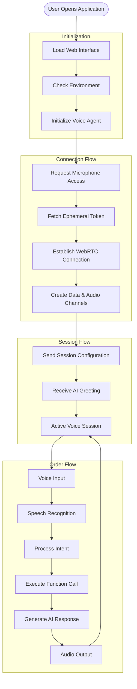

## Voice Processing Flow

```mermaid
flowchart LR
    subgraph "Audio Input Pipeline"
        Mic[Microphone Input]
        Stream[Media Stream]
        WebRTC[WebRTC Audio Track]
        Encode[Opus Encoding]
        Transport[SRTP Transport]
    end
    
    subgraph "OpenAI Processing"
        VAD[Voice Activity Detection]
        STT[Speech-to-Text]
        NLU[Natural Language Understanding]
        DM[Dialog Management]
        TTS[Text-to-Speech]
    end
    
    subgraph "Audio Output Pipeline"
        Receive[Receive Audio Stream]
        Decode[Opus Decoding]
        AudioEl[Audio Element]
        Speaker[Speaker Output]
    end
    
    Mic --> Stream
    Stream --> WebRTC
    WebRTC --> Encode
    Encode --> Transport
    Transport --> VAD
    VAD --> STT
    STT --> NLU
    NLU --> DM
    DM --> TTS
    TTS --> Receive
    Receive --> Decode
    Decode --> AudioEl
    AudioEl --> Speaker
```

## Function Call Flow

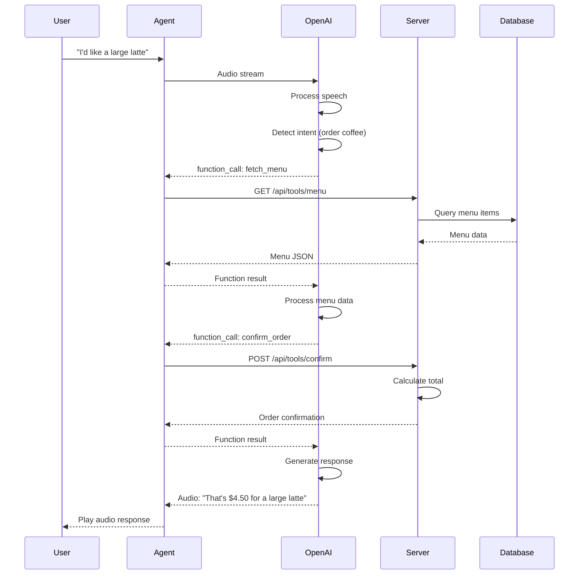

## Order State Machine

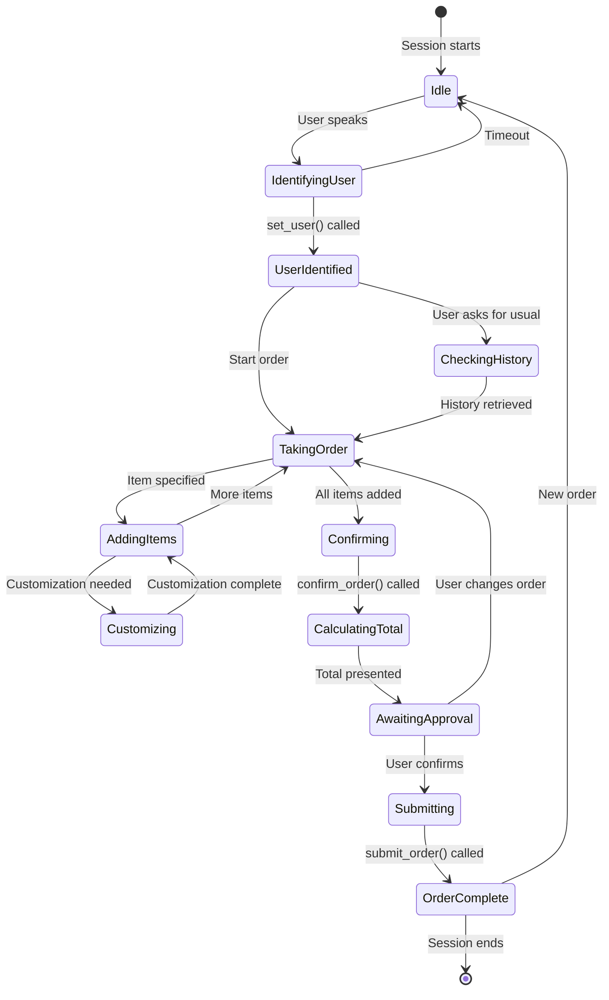

## Data Channel Event Flow

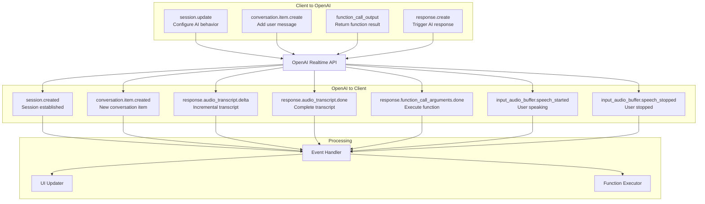

## Suggestion Engine Flow

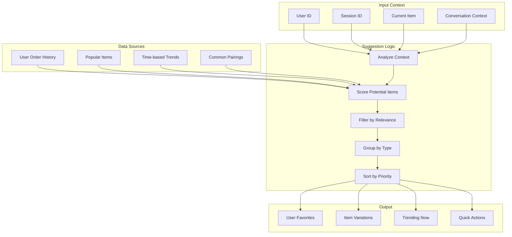

## Error Recovery Flow

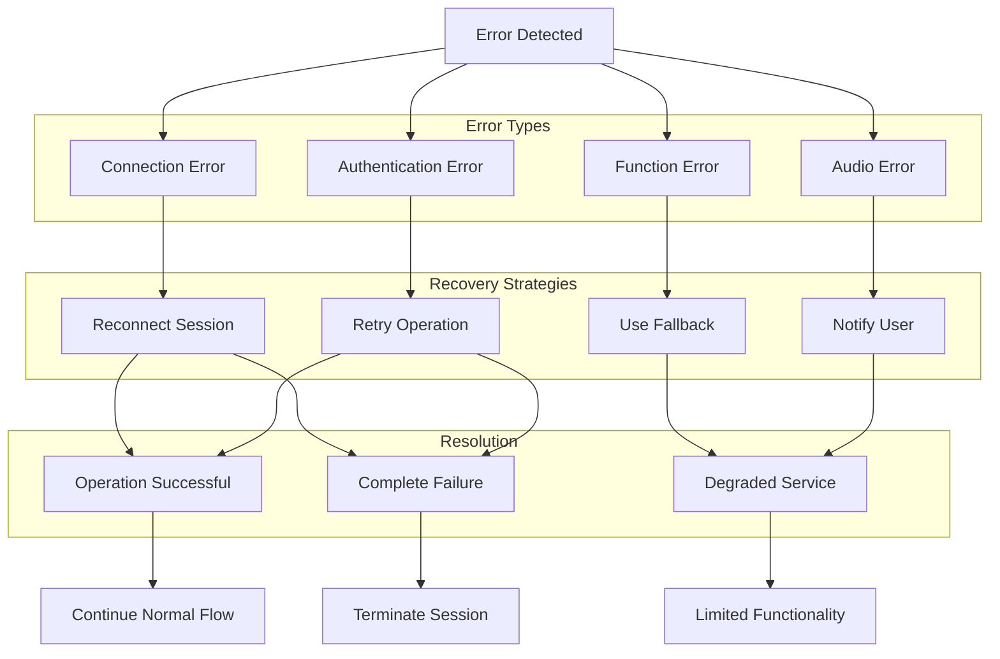

## Database Transaction Flow

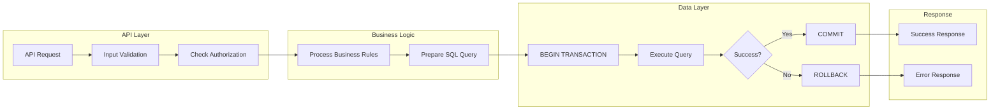

## Admin Dashboard Flow

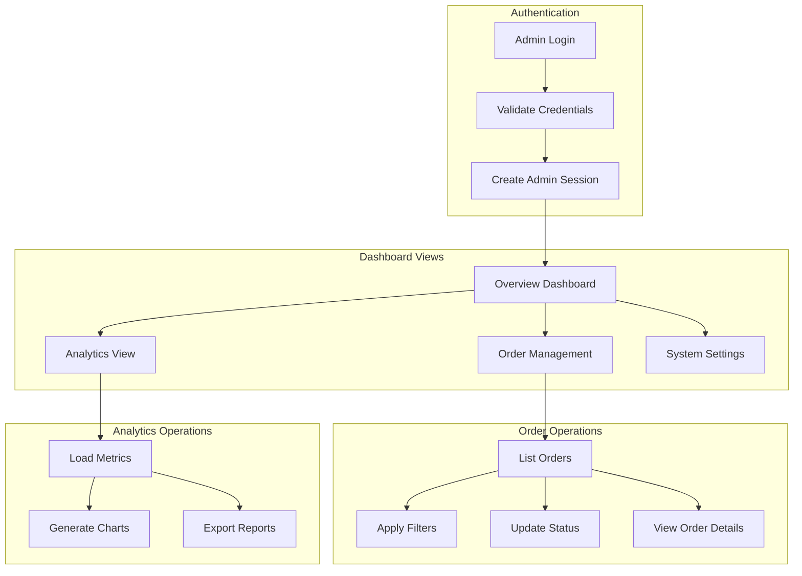

## Real-time Update Flow

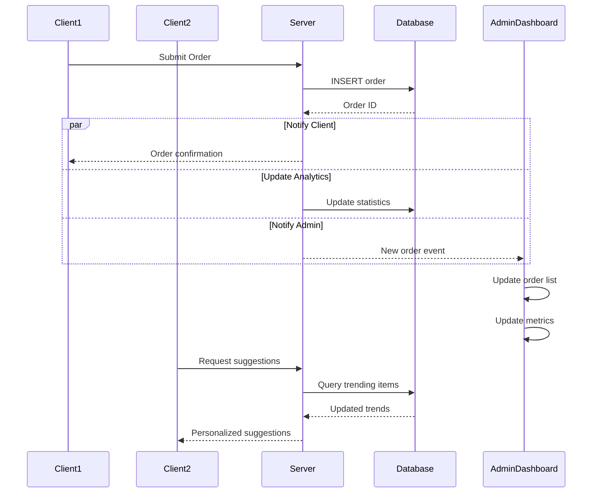

## Session Lifecycle Flow

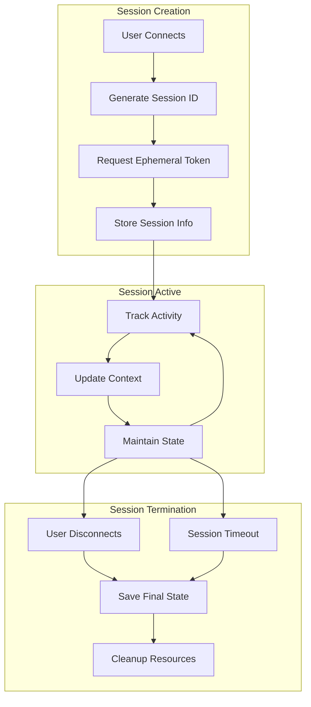

## Performance Optimization Flow

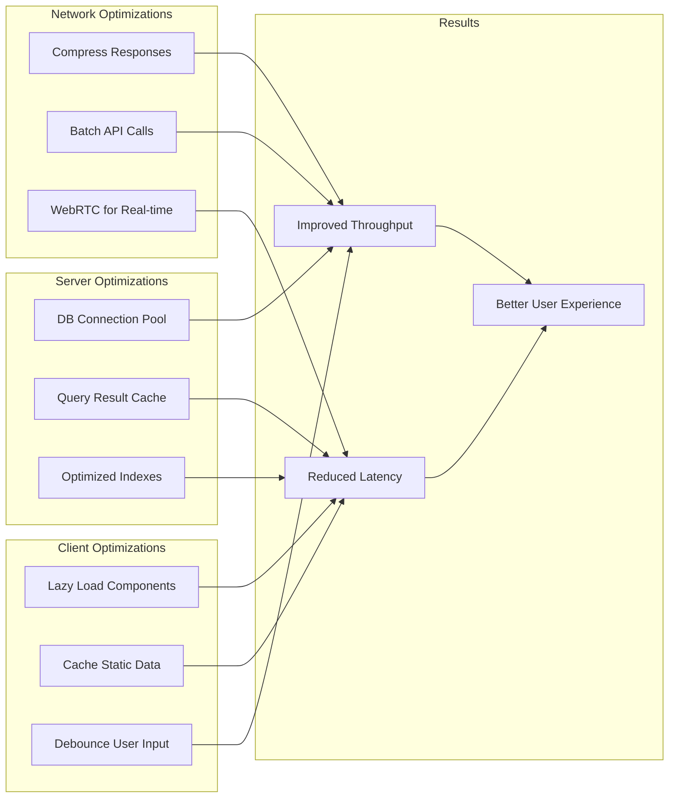