# Brew & Byte Café - Use Cases

## Overview
This document outlines the primary use cases for the Brew & Byte Café voice ordering system, detailing actor interactions and system behaviors.

## Actors

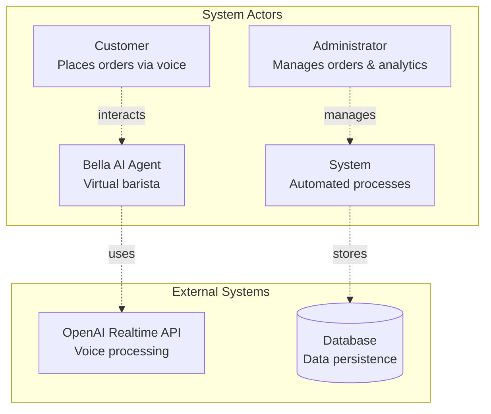

## Primary Use Cases

### UC1: Place Voice Order

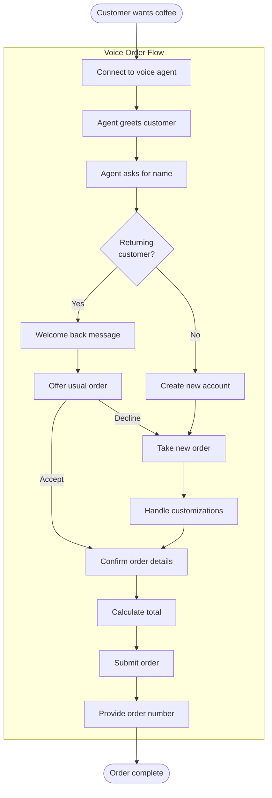

### UC2: Returning Customer Experience

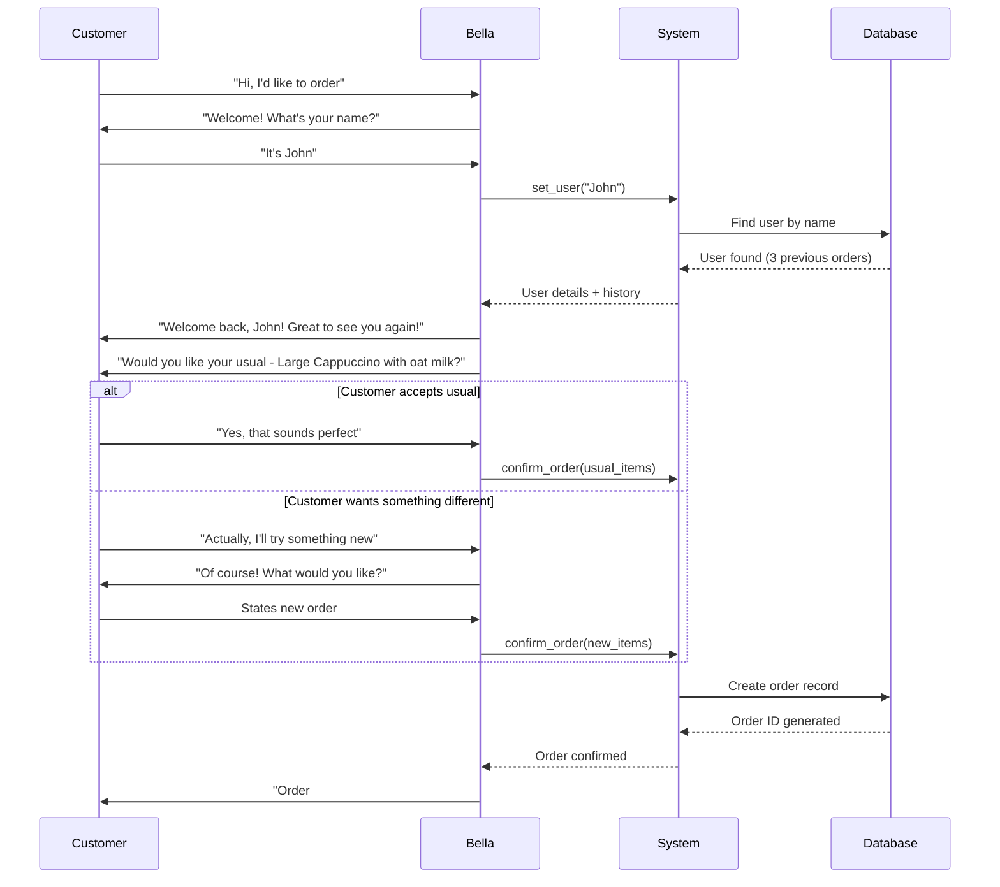

### UC3: Order Customization

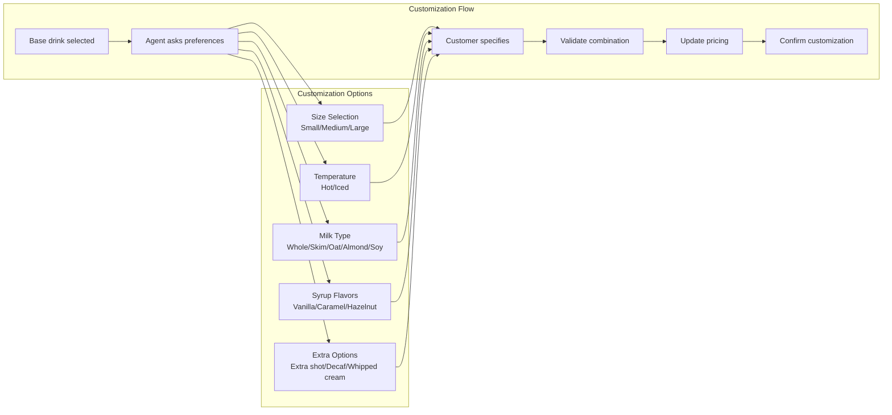

### UC4: Admin Dashboard Operations

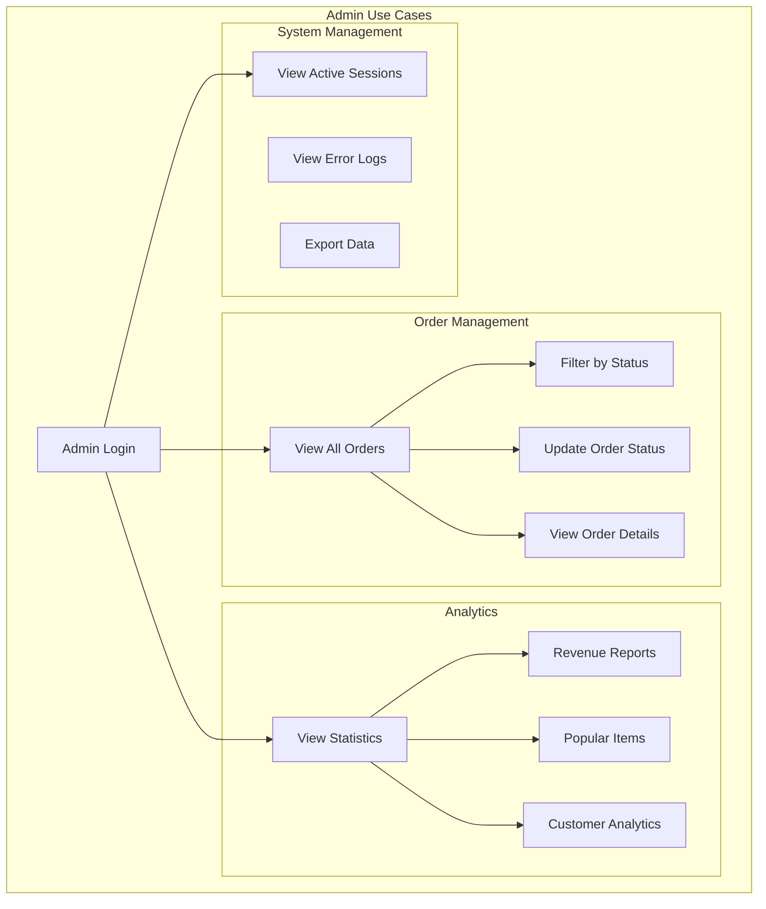

### UC5: Intelligent Suggestions

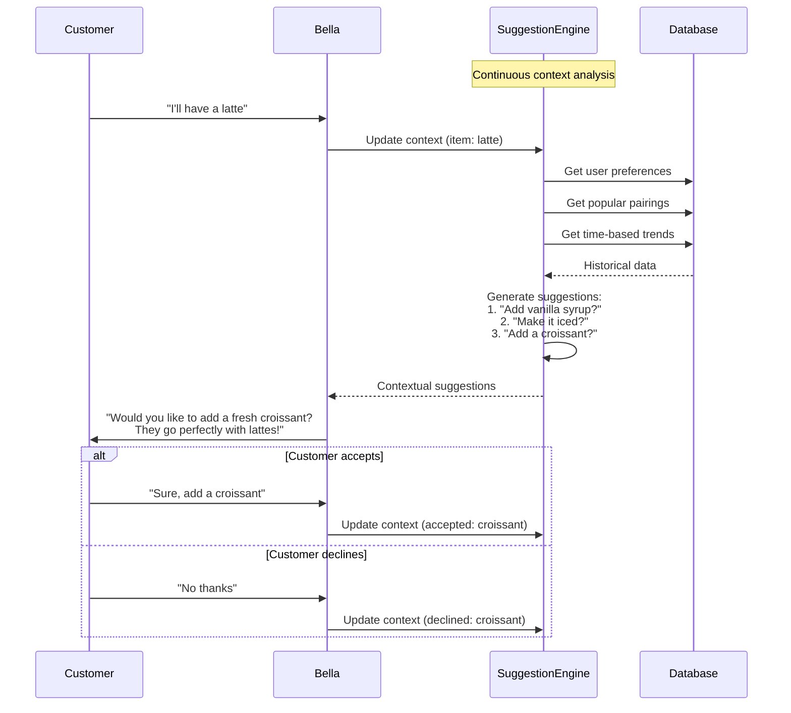

## Error Handling Use Cases

### UC6: Connection Failure Recovery

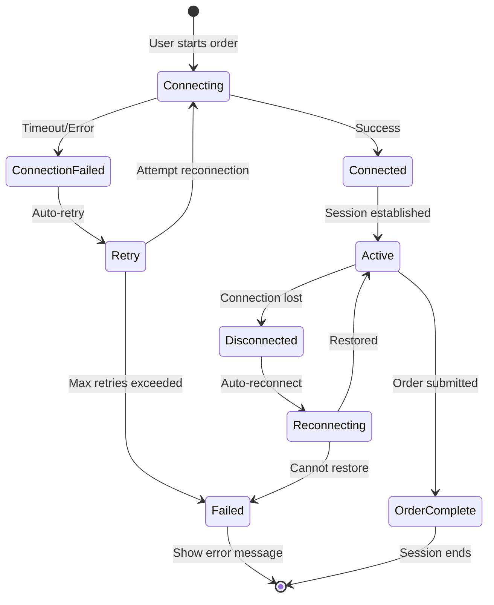

### UC7: Speech Recognition Challenges

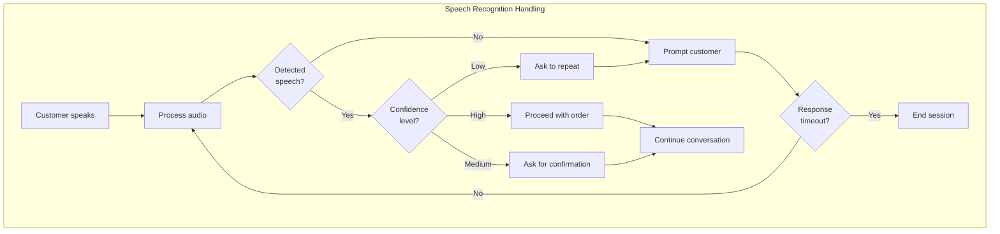

## Business Process Use Cases

### UC8: Order Fulfillment Workflow

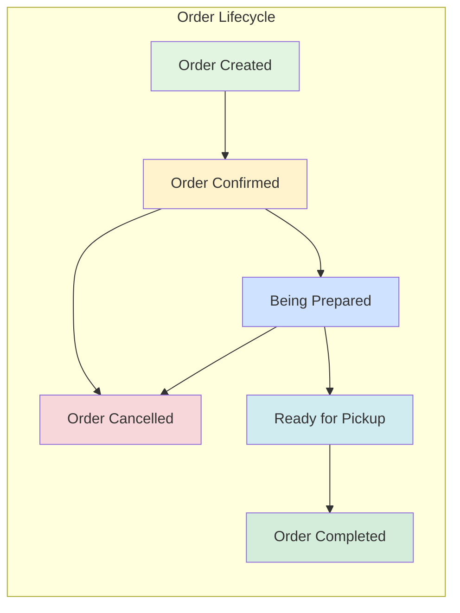

### UC9: Analytics and Reporting

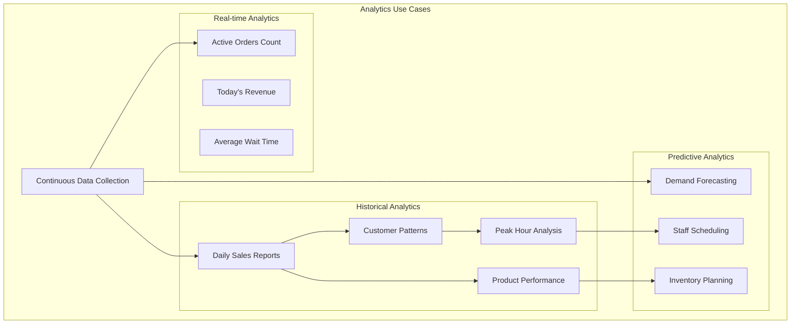

## Integration Use Cases

### UC10: Multi-channel Order Integration

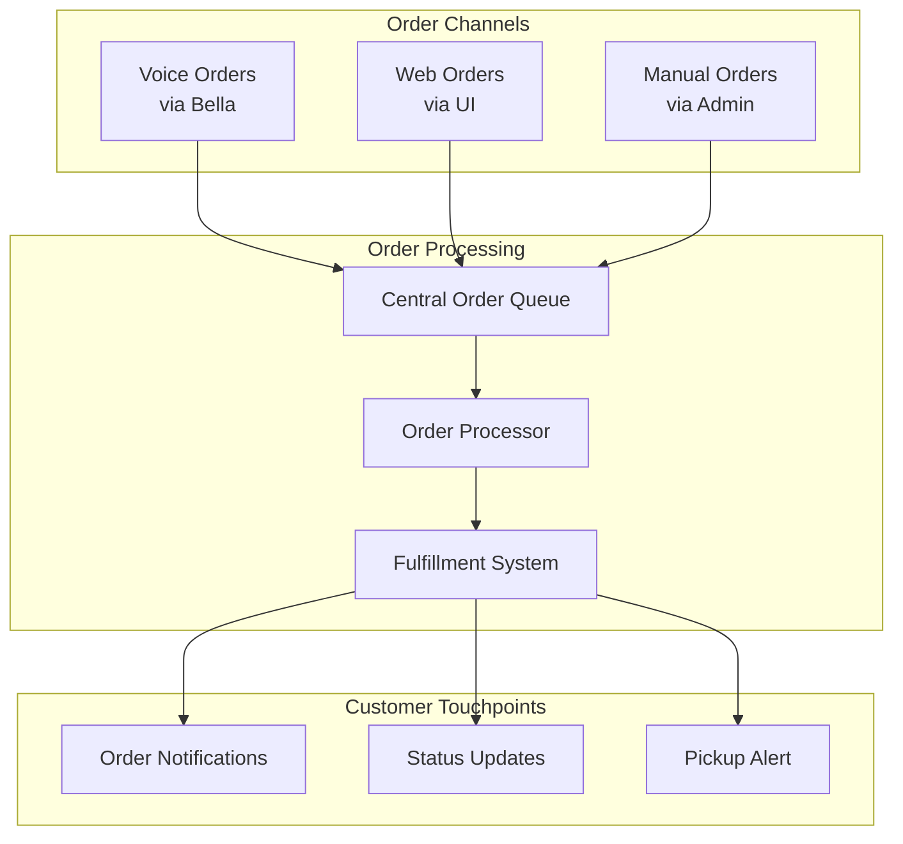

## Exception Cases

### UC11: Handling Edge Cases

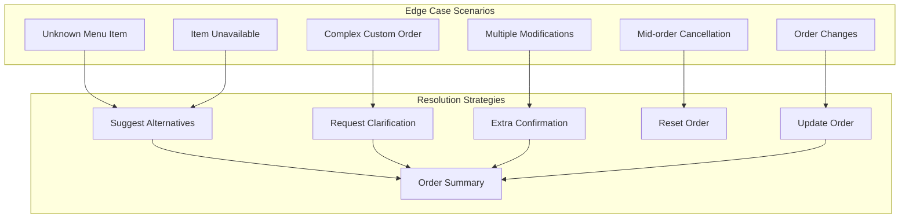

## User Journey Maps

### New Customer Journey

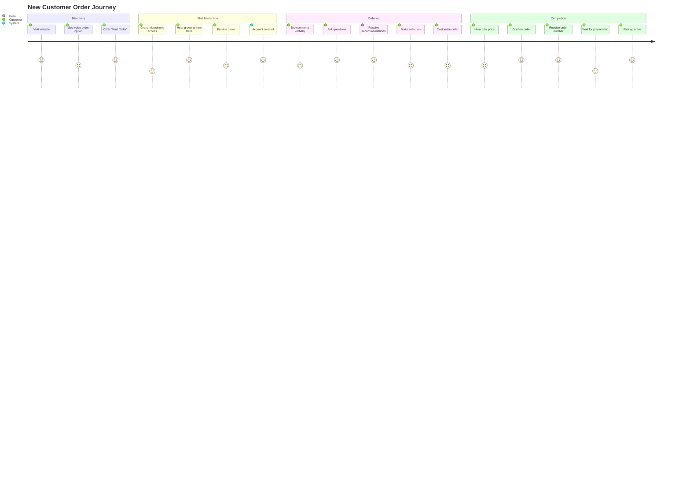

### Returning Customer Journey

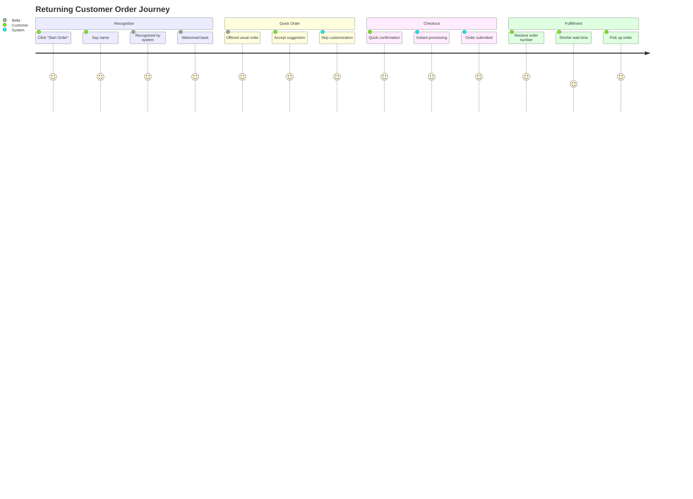